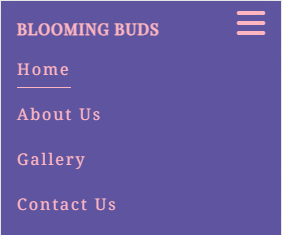

# *Blooming Buds*

Welcome to Bloomimg Buds Bouquet shop! From this wesite users get information about shops activities and services. The visitors of the website could quickly contact the shop to get beautiful bouquets and floral arrangements for various occasions.

The site can be accessed by this [link](https://sreeshmatharammal.github.io/blooming-buds/index.html)

# Table of Contents

- [UX](#ux "UX")  
  - [User Stories](#user-stories)  
    - [First Time Visitor Goals](#first-time-visitor-goals)
    - [Returning VisitorGoals](#returning-visitorgoals)
  - [Features](#features)
    - [Navbar](#navbar)
    - [Home Page](#home-page)
    - [About Us page](#about-us-page)
    - [Gallery Page](#gallery-page)
    - [Contact Us Page](#contact-us-page)
    - [Response Page](#response--page)
  - [Technologies used](#technologies-used)
  - [Design](#design)
    - [Color Scheme](#color-scheme)
    - [Typography](#typography)
    - [Wireframes](#wireframes)
        - [Mobile devices](#mobile-devices)
        - [Tablets](#tablets)
        - [Desktop](#desktop)
  - [Testing](#testing)
  - [Deployment](#deployment)
    - [Deployment to GitHub Pages](#deployment-to-github-pages)
    - [Local Deployment](local-deployment)
  - [Future improvements](#future-improvements)
  - [Credits](#credits)
    - [Content](#content)
    - [Media](#media)
    - [Tools](#tools)    
- [Acknowledgments](#acknowledgments)  

---
# UX

## User Stories

### First Time Visitor Goals:

* As a First Time Visitor, I want to easily understand the main purpose of the site, so I can learn more about the organization.
* As a First Time Visitor, I want to be able to easily navigate through the website, so I can find the content.
* As a First Time Visitor, I want to see the testimonials, so I can see whether the organization is trustworthy.

### Returning VisitorGoals:

* As a Returning Visitor, I want to see various bouquets, so that I can pick from.
* As a Returning Visitor, I want to see more collections of bouquets, so that I can select appropriate one.
* As a Returning Visitor, I want to find a way to get in contact with the organization, so that I can ask additional questions or send a request about their services.
* As a Returning Visitor, I want to find community links, so that I can learn more about the organization.

## Features

+ ### Navbar

+ ##### Navigation

    - Positioned at the top of the page.
    - Contains logo of the company on the left side.
    - Contains navigation links on the right side:
        * HOME - leads to the home page where users can get information about the company, avilable services and some feeback from customers.
        * ABOUT US - leads to the about us page where users can learn about the company and its history.
        * GALLERY - leads to the gallery page where users can see beautiful bouquets and some moments captured through the artistry of the company.
        * CONTACT US -  leads to the contact form page where users can fill out the form in order to get in touch with the company.
    - The links have animated hover effect.
    - The navigation is clear and easy to understand for the user.
    

    - The navigation bar is responsive:
        * On tablets: 

        

        * On mobile devices: 
        - navigation bar filled with the logo in the left and a hamburger menu implemented on the right side of the navigation bar.      
        
        
        - When the hamburger menu is clicked, there is dropdown menu with the links in the same order.

            

---

+ ### Home Page

- Represent: 

    * the main idea of the company.
    * Emphasize the strong points of the company.
    * Shows feedback from satisfied clients.       

---

+ #### Hero Section

- Hero section have a fixed background image.

- Hero section have the block section below the image that consist:

    * The name of the company.
    * Short description of the company's philosophy.
    
    

--- 

+ #### Service Section

    - Service Section has 4 cards with strong descriptive services of the company.

    - Tells website visitors features of each services.

    - Attracts viewers to include this company in their celebration.

    

 ---
 + #### Testimonials Section

    - Testimonials Section has three feedbacks from people who were satisfied with the company's service.

    - Each card has a picture of customer with smiling face.

    - Each card has a story from the people who had an experience the beauty of bouqets and  using the company services.

    - Each card has a name of the customer.

    

---
+ #### Footer

        - Footer contains social media links that open in a new tab.

---
+ ### About Us page

    - About Us page has a hero image and an introduction and history of the company.

    - It has a video showing two working florists working in the company.

    - The video play automatically when reach the About Us page. Video is muted.

    - This page contain name of individuals behind this company.

    - It has a footer identical to the home page's footer.

     

---
+ ### Gallery Page

    - Gallery page contain a heading that highlight user the content of this page.

    - This page showcase company's beautiful and creating work and some moments. 

    - It has a footer identical to the home page's footer.

    

---
+ ### Contact Us Page

    - Contact page has a contact form:

        - All text input fields are customized.
        - All input fields have seperate labels.
        - All inputs are set to be required to fill out except phone number.
        - There is text area for entering messages to the company.

    - The submit button is animated on hover.

    - The page is responsive on all common screen sizes.

    - The submit button leads to the response page.

    

---
+ ### Response  Page

    - Response page appears after submitting the contact form.

    - It contains the thank you message and the promise to get in touch with the applicant within 24 hours.

    - It contain back to home button to visit home page.

    

---
## Technologies Used

- [HTML](https://developer.mozilla.org/en-US/docs/Web/HTML) was used as the foundation of the site.
- [CSS](https://developer.mozilla.org/en-US/docs/Web/css) - was used to add the styles and layout of the site.
- [CSS Flexbox](https://developer.mozilla.org/en-US/docs/Learn/CSS/CSS_layout/Flexbox) - was used to arrange items simmetrically on the pages.
- [Balsamiq](https://balsamiq.com/) was used to make wireframes for the website.
- [VSCode](https://code.visualstudio.com/) was used as the main tool to write and edit code.
- [Git](https://git-scm.com/) was used for the version control of the website.
- [GitHub](https://github.com/) was used to host the code of the website.

---
## Design
    

### Color Scheme

### Typography

- Noto Serif Google Font was used as the main font of the website in order to increase readability of the content on the pages.

- Playfair display Google font was used for all headings including company's logo to attract viewers.

### Wireframes

#### Mobile devices
    
- [Home Page. Mobile Screen](documentation/mobile_home_page.png)
- [About Us Page. Mobile Screen](documentation/mobile_about_us_page.png)
- [Gallery Page. Mobile Screen](documentation/mobile_gallery_page.png)
- [Contact Us Page. Mobile Screen](documentation/mobile_contact_us_page.png)
- [Contact Receive Page. Mobile Screen](documentation/mobile_contact_receive_page.png)

#### Tablets
- [Home Page. Tablet Screen](documentation/tablet_home_page.png)
- [About Us Page. Tablet Screen](documentation/tablet_about_us_page.png)
- [Gallery Page. Tablet Screen](documentation/tablet_gallery_page.png)
- [Contact Us Page. Tablet Screen](documentation/tablet_contact_us_page.png)
- [Contact Receive Page. Tablet Screen](documentation/tablet_contact_receive_page.png)

#### Desktop
- [Home Page. Desktop Screen](documentation/desktop_home_page.png)
- [About Us Page. Desktop Screen](documentation/desktop_about_us_page.png)
- [Gallery Page. Desktop Screen](documentation/desktop_gallery_page.png)
- [Contact Us Page. Desktop Screen](documentation/desktop_contact_us_page.png)
- [Contact Receive Page. Desktop Screen](documentation/desktop_contact_receive_page.png)

---

## Testing

Please refer to the [TESTING.md](TESTING.md) file for all test-related documentation.

---

## Deployment

### Deployment to GitHub Pages

- The site was deployed to GitHub pages. The steps to deploy are as follows: 
    - In the [GitHub repository](https://github.com/SreeshmaTharammal/blooming-buds), navigate to the Settings tab
    - From the source section drop-down menu, select the **Main** Branch, then click "Save".
    - The page will be automatically refreshed with a detailed ribbon display to indicate the successful deployment.

The live link can be found [here](https://sreeshmatharammal.github.io/blooming-buds)

### Local Deployment

In order to make a local copy of this project, you can clone it.
In your IDE Terminal, type the following command to clone my repository:

- `git clone https://sreeshmatharammal.github.io/blooming-buds.git`

---

## Future improvements

  - Add support for online shopping.

---

## Credits

+ #### Content

    - Inspiration for the gallery and services section hover effect came from [Kevin Powell](https://www.youtube.com/user/KepowOb) on his YouTube channel.

    - Inspiration for the responsive hamburger navbar came from 'Love Running' project in Code Institute tutorial.

    - Inspiration for the horizontal lines in about us page came from "How to Add Horizontal Lines Before and After a Text in HTML" published the website [Unclebigbay's Blog](https://unclebigbay.com/how-to-add-horizontal-lines-before-and-after-a-text-in-html).

+ #### Media

- Images are taken from:
    + [Hero image](https://www.nytimes.com/wirecutter/reviews/best-online-flower-delivery/)
    + Services Section:
        - [Birthday Bouquets](https://www.deerfieldflorist.com/Products/Birthday/Happy_Birthday_Present_Bouquet/244648/13309)
        - [Anniversary Bouquets](https://lilyblooms.com.au/same-day-anniversary-flower-delivery/)
        - [Vase Flowers](https://roe.shein.com/1pc-Resin-In-Pot-Water-Culture-Hydroponic-Or-Imitation-Ceramic-Flower-Vase-For-Flower-Arrangement-p-19685958-cat-3893.html)
        - [Basket Flowers](https://bloommagicflowers.ie/collections/complete-range/products/sympathy-lavender-les-fleurs-sauvages-basket)
    + Testimonial  Section:
        - [1st image](https://www.freepik.com/free-photo/outdoor-portrait-happy-white-girl-posing-nature-photo-relaxed-lady-with-wavy-hair-standing-near-beautiful-rose-bush_11578421.htm)
        - [2nd image](https://create.vista.com/unlimited/stock-photos/337381056/stock-photo-outdoors-portrait-young-man-park/)
        - [3rd image](https://www.chipchick.com/2023/02/her-wedding-was-supposed-to-be-in-3-months-but-her-fiance-just-broke-up-with-her-in-the-strangest-way.html)
    + About Us Page:
       - [About us Hero image](https://www.freepik.com/premium-ai-image/woman-working-flower-shop-with-bouquet-flowers_59571397.htm)
       - [About Us video](https://www.videvo.net/video/florists-in-shop-working/571093/#rs=video-box)
    + Gallery Page:
        - [1st Image](https://www.citysavvyluxembourg.com/luxembourgs-best-flower-shops/)
        - [2nd Image](https://greenstockflorists.ie/about-us/)
        - [3rd Image](https://www.freepik.com/premium-photo/professional-woman-florist-talks-smartphone-taking-order-makes-bouquet-working-flower-shop-mature-woman-apron-floristry-studio-creating-beautiful-bunch-self-employed-people-concept_17715881.htm)
        - [4th Image](https://graziadaily.co.uk/interiors/garden/ts-the-time-of-year-when-we-all-fall-fleetingly-for-peonies-sponsored/)
        - [5th Image](https://www.bellandtrunk.com/shop/premium-bridal-bouquet)
        - [6th Image](https://www.istockphoto.com/photo/flower-market-gm597967708-102453799)
        - [7th Image](https://www.artandflower.com/pages/our-boutique)
        - [8th Image](https://bloomingboutique.ie/products/flower-bouquet-38?variant=35838886281382)
        - [9th Image](https://www.flowersforeveryone.com.au/pink-and-mauve-flowers-delivered/)
        - [10th Image](https://theflowershoponhill.ca/pages/gallery)
        - [11th Image](https://www.istockphoto.com/photo/appy-friendly-florist-giving-fresh-bouquet-to-customer-gm1369508988-439254122?phrase=black+flower+shop+owner&searchscope=image%2Cfilm)      
    + Contact Us Page:
        - [Contact us Hero image](https://myloview.com/sticker-female-hands-using-laptop-female-office-desk-workspace-homeoffice-no-B08A628)
    + Response Page:
        - [Background image](https://www.iphronline.org/sad-loss-brave-human-rights-defender-uzbekistan.html/spring-background-fruit-flowers-on-wooden-table)

+ #### Tools

  - [Favicon Generator](https://realfavicongenerator.net/) was used to generate favicon.
  - Ms Paint was used to resize images.

---

## Acknowledgments
- [Iuliia Konovalova](https://github.com/IuliiaKonovalova) was a great supporter of another bold idea of mine for this project. Iuliia guided me through the development of the project and helped me to learn a lot of new things by challenging me to do something new.
- [Code Institute](https://codeinstitute.net/) tutors and Slack community members for their support and help.
- [Kevin Powell](https://www.youtube.com/user/KepowOb) for his amazing CSS tutorials.

---