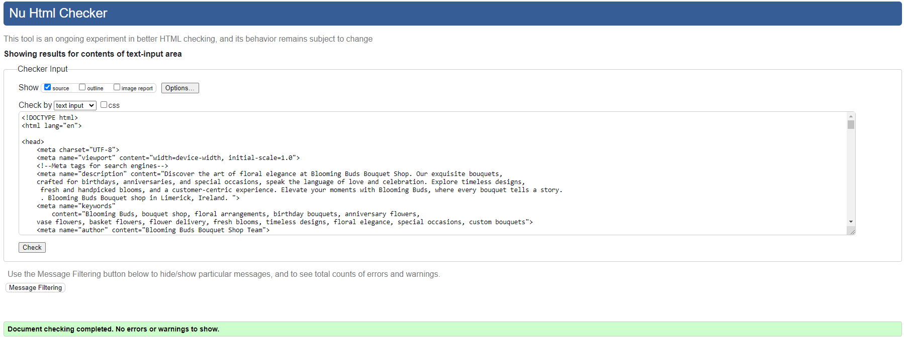
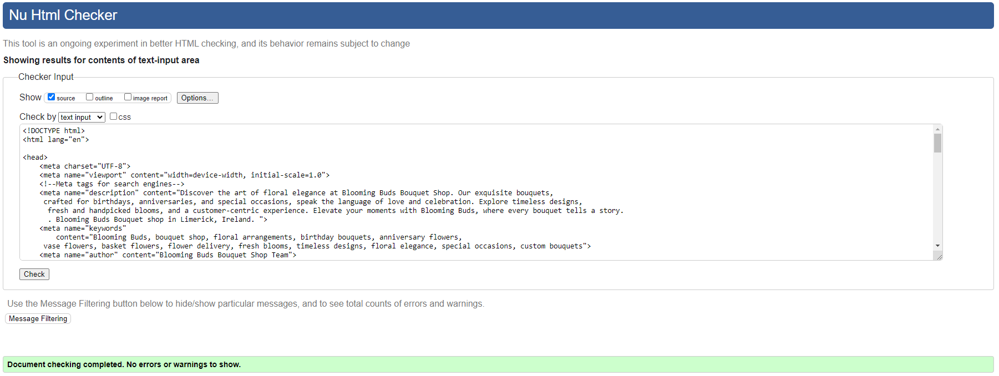
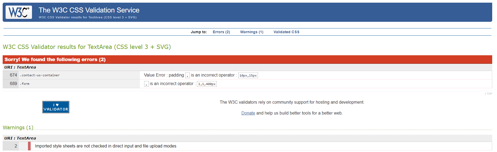
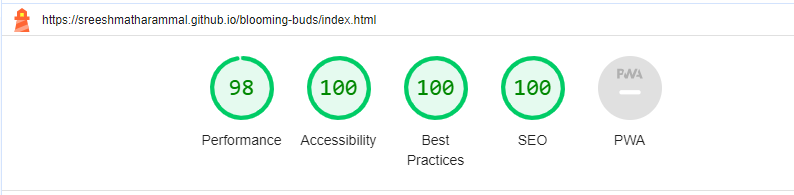
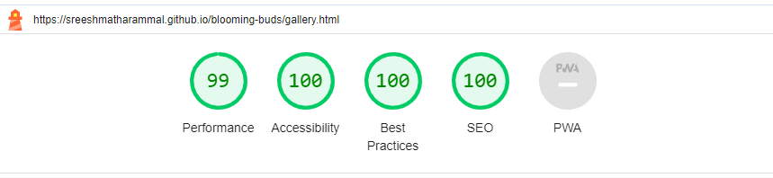

Attachment Manual testing overview.pdf added.None selected 

Skip to content
Using Gmail with screen readers

Conversations
10.67 GB of 15 GB (71%) used
Terms · Privacy · Program Policies
Last account activity: 13 minutes ago
Details
blooming buds
# TESTING

## Responsiveness

+ The website was checked by devtools implemented in Chrome browsers.

    ## Galaxy S9:

    

      

        <h4>Home Page</h4>
        
      

      

        <h4>About Us</h4>
        
      

      

        <h4>Gallery</h4>
        
      

      

        <h4>Contact Us</h4>
        
      

    

    
    ## Galaxy S20 Ultra:

    

      

        <h4>Home Page</h4>
        
      

      

        <h4>About Us</h4>
        
      

      

        <h4>Gallery</h4>
        
      

      

        <h4>Contact Us</h4>
        
      

    

    ## IPad Pro:

    

      

        <h4>Home Page</h4>
        
      

      

        <h4>About Us</h4>
        
      

      

        <h4>Gallery</h4>
        
      

      

        <h4>Contact Us</h4>
        
      

    

    ## IPhone X:

    

      

        <h4>Home Page</h4>
        
      

      

        <h4>About Us</h4>
        
      

      

        <h4>Gallery</h4>
        
      

      

        <h4>Contact Us</h4>
        
      

    

    ## Laptop 1024:

    

      

        <h4>Home Page</h4>
        
      

      

        <h4>About Us</h4>
        
      

      

        <h4>Gallery</h4>
        
      

      

        <h4>Contact Us</h4>
        
      

    

    ## Laptop 1440:

    

      

        <h4>Home Page</h4>
        
      

      

        <h4>About Us</h4>
        
      

      

        <h4>Gallery</h4>
        
      

      

        <h4>Contact Us</h4>
        
      

    

    ## Laptop 2560:

    

      

        <h4>Home Page</h4>
        
      

      

        <h4>About Us</h4>
        
      

      

        <h4>Gallery</h4>
        
      

      

        <h4>Contact Us</h4>
        
      

    

+ The website was checked with [Responsive Website Design Tester](https://responsivedesignchecker.com/).

    ## Desktop Screens:

    

      

        <h4>Desktop 1024x600</h4>
        <video width="320" height="240" controls>
          <source src="documentation/desktop_1024_600.mp4" type="video/mp4">
          Your browser does not support the video tag.
        </video>
      

      

        <h4>Desktop 1024x800</h4>
        <video width="320" height="240" controls>
          <source src="documentation/desktop_1024_800.mp4" type="video/mp4">
          Your browser does not support the video tag.
        </video>
      
      
      

        <h4>Desktop 1366x768</h4>
        <video width="320" height="240" controls>
          <source src="documentation/desktop_1366_768.mp4" type="video/mp4">
          Your browser does not support the video tag.
        </video>
      

    

    
    
      
      

        <h4>Desktop 1440x900</h4>
        <video width="320" height="240" controls>
          <source src="documentation/desktop_1440_900.mp4" type="video/mp4">
          Your browser does not support the video tag.
        </video>
      

      

        <h4>Desktop 1600x900</h4>
        <video width="320" height="240" controls>
          <source src="documentation/desktop_1600_900.mp4" type="video/mp4">
          Your browser does not support the video tag.
        </video>
      

      

        <h4>Desktop 1680x1050</h4>
        <video width="320" height="240" controls>
          <source src="documentation/desktop_1680_1050.mp4" type="video/mp4">
          Your browser does not support the video tag.
        </video>
      

    

    

      

        <h4>Desktop 1920x1080</h4>
        <video width="320" height="240" controls>
          <source src="documentation/desktop_1920_1080.mp4" type="video/mp4">
          Your browser does not support the video tag.
        </video>
      

      

        <h4>Desktop 1920x1200</h4>
        <video width="320" height="240" controls>
          <source src="documentation/desktop_1920_1200.mp4" type="video/mp4">
          Your browser does not support the video tag.
        </video>
      

    

    ## Tablet Screens:

    
      
      

        <h4>Tablet 600x960</h4>
        <video width="320" height="240" controls>
          <source src="documentation/tablet_600_960.mp4" type="video/mp4">
          Your browser does not support the video tag.
        </video>
      

      

        <h4>Tablet 768x1024</h4>
        <video width="320" height="240" controls>
          <source src="documentation/tablet_768_1024.mp4" type="video/mp4">
          Your browser does not support the video tag.
        </video>
      

      

        <h4>Tablet 800x1280</h4>
        <video width="320" height="240" controls>
          <source src="documentation/tablet_800_1280.mp4" type="video/mp4">
          Your browser does not support the video tag.
        </video>
      

    

    

      

        <h4>Tablet 1024x768</h4>
        <video width="320" height="240" controls>
          <source src="documentation/tablet_1024_768.mp4" type="video/mp4">
          Your browser does not support the video tag.
        </video>
      

      

        <h4>Tablet 1366x1024</h4>
        <video width="320" height="240" controls>
          <source src="documentation/tablet_1366_1024.mp4" type="video/mp4">
          Your browser does not support the video tag.
        </video>
      

    

    - Mobile Screens:
    
      
      

        <h4>Mobile 320x480</h4>
        <video width="320" height="240" controls>
          <source src="documentation/mobile_320_480.mp4" type="video/mp4">
          Your browser does not support the video tag.
        </video>
      

      

        <h4>Mobile 320x568</h4>
        <video width="320" height="240" controls>
          <source src="documentation/mobile_320_568.mp4" type="video/mp4">
          Your browser does not support the video tag.
        </video>
      

      

        <h4>Mobile 360x640</h4>
        <video width="320" height="240" controls>
          <source src="documentation/mobile_360_640.mp4" type="video/mp4">
          Your browser does not support the video tag.
        </video>
      

    

    
      
      

        <h4>Mobile 375x667</h4>
        <video width="320" height="240" controls>
          <source src="documentation/mobile_375_667.mp4" type="video/mp4">
          Your browser does not support the video tag.
        </video>
      

      

        <h4>Mobile 384x640</h4>
        <video width="320" height="240" controls>
          <source src="documentation/mobile_384_640.mp4" type="video/mp4">
          Your browser does not support the video tag.
        </video>
      

      

        <h4>Mobile 411x731</h4>
        <video width="320" height="240" controls>
          <source src="documentation/mobile_411_731.mp4" type="video/mp4">
          Your browser does not support the video tag.
        </video>
      

    

    

      

        <h4>Mobile 414x736</h4>
        <video width="320" height="240" controls>
          <source src="documentation/mobile_414_736.mp4" type="video/mp4">
          Your browser does not support the video tag.
        </video>
      

    

                                     | Galaxy S9 | Galaxy S20 Ultra  | IPhone X  | IPad Pro  | Desktop 1024  | Desktop 1440  | Desktop > 1200px  |
| --------                              | --------  | --------          | --------  | --------  | --------      | --------      | --------          |
| Site is  responsive for >= 700px   | n/a       | n/a               | n/a       | Good      | Good          | Good          | Good              |
| Site is  responsive for < 699px    | Good      | Good              | Good      | n/a       | n/a           | n/a           | n/a               |
 
| Links / URLs work                     | Good      | Good              | Good      | Good      | Good          | Good          | Good              |
| Images work                           | Good      | Good              | Good      | Good      | Good          | Good          | Good              |
| Renders are expected                  | Good      | Good              | Good      | Good      | Good          | Good          | Good              |

## Compatibility

In order to confirm the correct functionality, responsiveness, and appearance:

+ The website was tested on the following browsers: Chrome, Edge.

    - Chrome:

    

    - Edge:

    

    - Brave:

    

## Manual testing

| feature | action | expected result | tested | passed | comments |
| --- | --- | --- | --- | --- | --- |
| Navbar | | | | | |
| Home | Click on the "Home" link | The user is redirected to the main page | Yes | Yes | - |
| About Us | Click on the "About US" link | The user is redirected to the about us page | Yes | Yes | - |
| Gallery | Click on the "Gallery" link | The user is redirected to the gallery page | Yes | Yes | - |
| Contact Us| Click on the "Contact Us" link | The user is redirected to the contact us page | Yes | Yes | - |
| Footer | | | | | |
| Facebook icon in the footer | Click on the Facebook icon | The user is redirected to the Facebook page | Yes | Yes | - |
| Twitter icon in the footer | Click on the Twitter icon | The user is redirected to the Twitter page | Yes | Yes | - |
| YouTube icon in the footer | Click on the YouTube icon | The user is redirected to the YouTube page | Yes | Yes | - |
| Instagram icon in the footer | Click on the Instagram icon | The user is redirected to the Instagram page | Yes | Yes | - |
| Contact page | | | | | |
| Name input | Enter the name | The name is entered | Yes | Yes | If user doesn't enter the name, the error message appears |
| Email input | Enter the email | The email is entered | Yes | Yes | If user doesn't enter the email, the error message appears. If user enters not valid email, the error message appears |
| Phone number | Enter the email | The phone number is entered | Yes | Yes | This field is not manadatory. If phone number is entered it is validated against valid Irish number |
| Message | Enter message | The message is entered | Yes | Yes | If user doesn't enter the message, the error message appears |
| "Submit" button | Click on the "Submit" button | The user is redirected to the response page | Yes | Yes | - |
| Response page | | | | | |
| Response message |   | "Thank you for contacting Blooming Buds!" message appears along with Back to Home button  | Yes | Yes | - |
| Back to Home button | Click on Back to Home button | The user is redirected to the home page | Yes | Yes | - |

---
## Validator testing
+ ### HTML
  #### Home Page
    - No errors or warnings were found when passing through the official W3C validator.

    
    
  #### Gallery Page
    - No errors or warnings were found when passing through the official W3C validator.

    

  #### Contact Page
    - No errors or warnings were found when passing through the official W3C validator.

    

  #### Response Page
    - No errors or warnings were found when passing through the official W3C validator.

    
    
+ ### CSS
  No errors or warnings were found when passing through the official W3C (Jigsaw) validator except:
    
    - 3 errors regarding *all: unset*: "Property all doesn't exist. The closest matching property name is fill : unset".

    - Even though this error is present, I don't believe it is 100% accurate, and more information can be found [here](https://developer.mozilla.org/en-US/docs/Web/CSS/all)

  
  
    - 43 warning regarding the use of *:root variables*: "Due to their dynamic nature, CSS variables are currently not statically checked".
    
  

+ ## LightHouse report

    - Using lighthouse in devtools I confirmed that the website is performing well, accessible and colors and fonts chosen are readable.
    
  ### Home page

  

  ### Gallery page

  

  ### Contact page

  

  ### Response page

  

---
​
## Bugs
+ ### Solved bugs
    1. The testimonials pictures had a square shape in Brave browser on a mobile phone when the border radius had been set to 50%. It was due to the outline properties settings instead of the border
    
        *Solutions:* Outline was replaced with border properties.
    
    1. The gallery image descriptions were not appearing on the picture when hovering it as the position of the .image_content was set to fixed.
        
        *Solution:* The .image_content position was set to absolute, with the top: 0, left: 0, and added padding on the .image_content. 

    1. Footer on the contact page was reducing the size of the screen and shrank the contact form as the height of the background image was set to calc(100vh-the size of the footer)
        
        *Solution:* The height of the image was set to 100hv, and the display of the footer was set to fixed.
    ---
+ ### Unsolved bugs
    - None.
+ ### Mistakes
    - Mistakes were made while committing changes. I used past simple tense in commits due to the habit when I just started working on this project.
    - While progressing in my code I learned to use present simple tense in commits.

---
TESTING.md
Displaying TESTING.md.