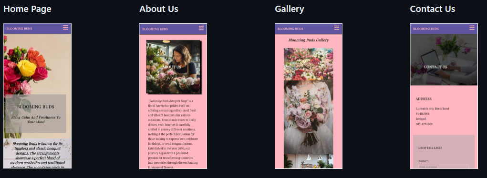
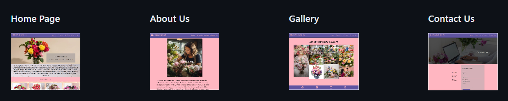
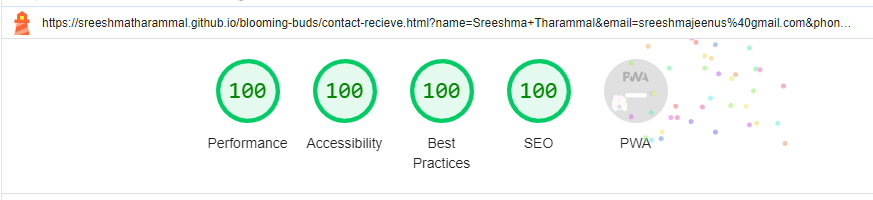

Attachment Manual testing overview.pdf added.None selected 

Skip to content
Using Gmail with screen readers

Conversations
10.67 GB of 15 GB (71%) used
Terms · Privacy · Program Policies
Last account activity: 13 minutes ago
Details
blooming buds
# TESTING

## Responsiveness

+ The website was checked by devtools implemented in Chrome browsers.

    ## Galaxy S9:

    
    
    ## Galaxy S20 Ultra:

    

    ## IPad Pro:

    

    ## IPhone X:

    

    ## Laptop 1024:

    

    ## Laptop 1440:

    

    ## Laptop 2560:

    

+ The website was checked with [Responsive Website Design Tester](https://responsivedesignchecker.com/).

    ## Desktop Screens:
    ### Desktop 1024x600
    

    ### Desktop 1024x800
    

    ### Desktop 1366x768
    
    
    ### Desktop 1440x900
    

    ### Desktop 1600x900
    

    ### Desktop 1680x1050
    
    
    ### Desktop 1920x1080
    

    ### Desktop 1920x1200
    

    ## Tablet Screens:
    ### Tablet 600x960
    
    
    ### Tablet 768x1024
    
    
    ### Tablet 800x1280
    
    
    ### Tablet 1024x768
    
    
    ### Tablet 1366x1024
    

    - Mobile Screens:
    ### Mobile 320x480
    
    
    ### Mobile 320x568
    
    
    ### Mobile 360x640
    
    
    ### Mobile 375x667
    
    
    ### Mobile 384x640
    

    ### Mobile 411x731
    
    
    ### Mobile 414x736
    

                                     | Galaxy S9 | Galaxy S20 Ultra  | IPhone X  | IPad Pro  | Desktop 1024  | Desktop 1440  | Desktop > 1200px  |
| --------                              | --------  | --------          | --------  | --------  | --------      | --------      | --------          |
| Site is  responsive for >= 700px   | n/a       | n/a               | n/a       | Good      | Good          | Good          | Good              |
| Site is  responsive for < 699px    | Good      | Good              | Good      | n/a       | n/a           | n/a           | n/a               |
 
| Links / URLs work                     | Good      | Good              | Good      | Good      | Good          | Good          | Good              |
| Images work                           | Good      | Good              | Good      | Good      | Good          | Good          | Good              |
| Renders are expected                  | Good      | Good              | Good      | Good      | Good          | Good          | Good              |

## Compatibility

In order to confirm the correct functionality, responsiveness, and appearance:

+ The website was tested on the following browsers: Chrome, Edge.

    - Chrome:

    

    - Edge:

    

## Manual testing

| feature | action | expected result | tested | passed | comments |
| --- | --- | --- | --- | --- | --- |
| Navbar | | | | | |
| Home | Click on the "Home" link | The user is redirected to the main page | Yes | Yes | - |
| About Us | Click on the "About US" link | The user is redirected to the about us page | Yes | Yes | - |
| Gallery | Click on the "Gallery" link | The user is redirected to the gallery page | Yes | Yes | - |
| Contact Us| Click on the "Contact Us" link | The user is redirected to the contact us page | Yes | Yes | - |
| Footer | | | | | |
| Facebook icon in the footer | Click on the Facebook icon | The user is redirected to the Facebook page | Yes | Yes | - |
| Twitter icon in the footer | Click on the Twitter icon | The user is redirected to the Twitter page | Yes | Yes | - |
| YouTube icon in the footer | Click on the YouTube icon | The user is redirected to the YouTube page | Yes | Yes | - |
| Instagram icon in the footer | Click on the Instagram icon | The user is redirected to the Instagram page | Yes | Yes | - |
| Contact page | | | | | |
| Name input | Enter the name | The name is entered | Yes | Yes | If user doesn't enter the name, the error message appears |
| Email input | Enter the email | The email is entered | Yes | Yes | If user doesn't enter the email, the error message appears. If user enters not valid email, the error message appears |
| Phone number | Enter the email | The phone number is entered | Yes | Yes | This field is not manadatory. If phone number is entered it is validated against valid Irish number |
| Message | Enter message | The message is entered | Yes | Yes | If user doesn't enter the message, the error message appears |
| "Submit" button | Click on the "Submit" button | The user is redirected to the response page | Yes | Yes | - |
| Response page | | | | | |
| Response message |   | "Thank you for contacting Blooming Buds!" message appears along with Back to Home button  | Yes | Yes | - |
| Back to Home button | Click on Back to Home button | The user is redirected to the home page | Yes | Yes | - |

---
## Validator testing
+ ### HTML
  #### Home Page
    - No errors or warnings were found when passing through the official W3C validator.

    

  #### About Us Page
    - No errors or warnings were found when passing through the official W3C validator.

    
    
  #### Gallery Page
    - No errors or warnings were found when passing through the official W3C validator.

    

  #### Contact Page
    - No errors or warnings were found when passing through the official W3C validator.

    

  #### Response Page
    - No errors or warnings were found when passing through the official W3C validator.

    
    
+ ### CSS
  No errors or warnings were found when passing through the official W3C (Jigsaw) validator except: 
    - One warning regarding import statement  "Imported style sheets are not checked in direct input and file upload modes"
    
  

+ ## LightHouse report

    - Using lighthouse in devtools I confirmed that the website is performing well, accessible and colors and fonts chosen are readable.
    
  ### Home page

  

  ### Gallery page

  

  ### Contact page

  

  ### Response page

  

---
​
## Bugs
+ ### Solved bugs
    1. Flickering in gallery page when mouse hover feature added
    
        *Solutions:* Padding applied to fix this issue.
    
    2. About us page hero image was not showing in edge browser.
        
        *Solution:* Converted image to JPEG format. 
    
    ---
+ ### Unsolved bugs
    - None.
+ ### Mistakes
    - While updating readme used mp4 files and html tags. The vscode preview showing expected behaviour
    - Reliazed github markdown does not support this. Converted to GIF.

---